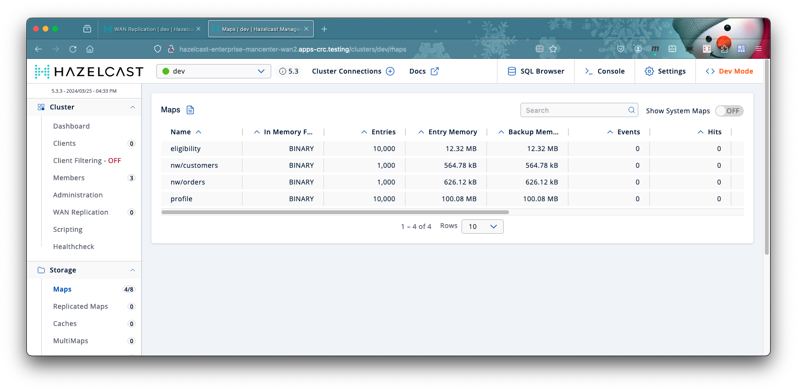

 [*PadoGrid*](https://github.com/padogrid) | [*Catalogs*](https://github.com/padogrid/catalog-bundles/blob/master/all-catalog.md) | [*Manual*](https://github.com/padogrid/padogrid/wiki) | [*FAQ*](https://github.com/padogrid/padogrid/wiki/faq) | [*Releases*](https://github.com/padogrid/padogrid/releases) | [*Templates*](https://github.com/padogrid/padogrid/wiki/Using-Bundle-Templates) | [*Pods*](https://github.com/padogrid/padogrid/wiki/Understanding-Padogrid-Pods) | [*Kubernetes*](https://github.com/padogrid/padogrid/wiki/Kubernetes) | [*Docker*](https://github.com/padogrid/padogrid/wiki/Docker) | [*Apps*](https://github.com/padogrid/padogrid/wiki/Apps) | [*Quick Start*](https://github.com/padogrid/padogrid/wiki/Quick-Start)

---

<!-- Platforms -->
[](https://github.com/padogrid/padogrid/wiki/Platform-PadoGrid-1.x) [](https://github.com/padogrid/padogrid/wiki/Platform-Host-OS) [](https://github.com/padogrid/padogrid/wiki/Platform-Kubernetes)

# Hazelcast WAN Replication on OpenShift using Helm Charts

This bundle demonstrates the Hazelcast WAN topology by replicating data between two (2) Hazlecast Helm Chart clusters running on OpenShift.

[https://github.com/hazelcast/charts](https://github.com/hazelcast/charts)

## Installing Bundle

```bash
install_bundle -download bundle-hazelcast-3n4n5-k8s-oc_helm_wan
```

## Use Case

This bundle installs PadoGrid and Hazelcast containers in two separate projects with WAN replication enabled. As shown in the diagram below, PadoGrid is used to ingest data into the first cluster named **wan1** which in turn publishes data to the second cluster named **wan2**. It includes scripts for starting and stopping containers per project.


## Required Software

- OpenShift Client, **oc**
- [Helm](https://helm.sh/docs/intro/install/), **helm**

❗ If you are using OpenShift 3.x (3.11+ in particular), then this bundle depends on `redhat/openshift-ovs-networkpolicy`, to create **NetworkPolicy** objects for enabling communications between projects. The `bin_sh/init_netpol` script is provided to allow project-to-project network connections. Please see [Section 5](#5-initialize-openshift-cluster),  [1] and [2] for details.

## Directory Tree View

```console
k8s/oc_helm_wan/
├── bin_sh
│   ├── build_app
│   ├── cleanup
│   ├── init_cluster
│   ├── init_netpol
│   ├── init_wan1
│   ├── login_padogrid_pod
│   ├── setenv.sh
│   ├── show_hazelcast_ips
│   ├── start_hazelcast
│   ├── start_padogrid
│   ├── stop_hazelcast
│   └── stop_padogrid
├── cluster
│   ├── hazelcast-rbac.yaml
│   ├── hazelcastcluster.crd.yaml
│   ├── operator-rbac.yaml
│   ├── pv-hostPath.yaml
│   ├── wan1-netpol.yaml
│   └── wan2-netpol.yaml
├── padogrid
│   ├── padogrid-no-pvc.yaml
│   ├── padogrid.yaml
│   └── pv-hostPath.yaml
└── templates
    ├── cluster
    ├── common
    ├── wan1
    └── wan2
```

## 0. Hazelcast Enterprise License Key

Place your Hazelcast Enterprise license key in the RWE environment file as follows.

```bash
cd_rwe
vi .hazelcastenv.sh
```

Set IMDG_LICENSE_KEY and MC_LICENSE_KEY in `.hazelcastenv.sh`:

```bash
IMDG_LICENSE_KEY=<your license key>
MC_LICENSE_KEY=<your license key>
```

## 1. Create Projects

This bundle requires two (2) OpenShift projects. It is preconfigured with the project names, **wan1** and **wan2**. You can change the project names in the `setenv.sh` file as follows.

```bash
cd_k8s oc_helm_wan/bin_sh
vi setenv.sh
```

Enter your project names in `setenv.sh`.

```bash
...
export PROJECT_WAN1="wan1"
export PROJECT_WAN2="wan2"
...
```

Source in the `setenv.sh` file.

```bash
cd_k8s oc_helm_wan/bin_sh
. ./setenv.sh
```

Create OpenShift projects.

```bash
oc new-project $PROJECT_WAN1
oc new-project $PROJECT_WAN2
```

## 2. Build Local Environment

Run `build_app` to intialize your local environment.

```bash
cd_k8s oc_helm_wan/bin_sh
./build_app
```

The `build_app` script performs the following:

- Creates`cluster`, `wan1`, and `wan2` directories containing OpenShift configuration files.
- Updates `secret.yaml` with the encrypted Hazelcast license key.

## 3. Add User to `anyuid` SCC (Security Context Constraints)

PadoGrid runs as a non-root user that requires read/write permissions to the persistent volume. Let's add your project's default user to the anyuid SCC.

```bash
oc edit scc anyuid
```

Add your project under the `users:` section. For example, if your projects are `wan1` and `wan2` then add the following line.

```yaml
users:
- system:serviceaccount:wan1:default
- system:serviceaccount:wan2:default
```

## 4. Initialize OpenShift Cluster

### 4.1 CRD and Cluster Role

We need to setup cluster-level objects to enable project-to-project communications. The `init_cluster` script is provided to accomplish the following:

- Apply **CustomResourceDefintion** for Hazelcast Operator
- Apply **ClusterRole** for Hazelcast Operator and Hazelcast

```bash
cd_k8s oc_helm_wan/bin_sh
./init_cluster
```

### 4.2 NetworkPolicy (for OpenShift 3.x only)

❗ *Skip this section if are using OpenShift 4.x.*

- Create **NetworkPolicy** Objects for both projects

```bash
cd_k8s oc_helm_wan/bin_sh
./init_netpol
```

You can view the **NetworkPolicy** objects as follows.

```bash
# Verify the cluster has 'ovs-networkpolicy'
oc get clusternetwork

# List NetworkPolicy objects in the current project
oc get netpol

# Display detailed information on the named NetworkPolicy object
oc describe netpol <name>

# Display ywam output of the named NetworkPolicy object
oc get netpol <name> -o yaml
```

✏️ *NetworkPolicy is project scoped such that it will be deleted when the project is deleted.*

## 5. Launch Hazelcast

✏️ The `start_hazelcast` script is provided to start a Hazelcast cluster. You can optionally specify the Hazelcast version as shown below. Run `./start_hazelcast -?` to see the usage.

```console
start_hazelcast wan1|wan2 [hazelcast_version] [-?]
```

### 5.1. Launch Hazelcast in `$PROJECT_WAN2`

Launch the Hazelcast cluster in the `$PROJECT_WAN2` project first. Since Hazelcast currently does not provide the WAN discovery service, we must first start the target cluster and get its member cluster IP addresses.


```bash
cd_k8s oc_helm_wan/bin_sh
./start_hazelcast $PROJECT_WAN2
```

Hazelcast has been configured with securityContext enabled. It might fail to start due to the security constraint of fsGroup. Check the StatefulSet events using the `describe` command as follows.

```bash
oc describe --namespace=$PROJECT_WAN2 statefulset hazelcast-enterprise
```

Output:

```console
...
Events:
  Type     Reason        Age                  From                    Message
  ----     ------        ----                 ----                    -------
  Warning  FailedCreate  46s (x15 over 2m8s)  statefulset-controller  create Pod hazelcast-enterprise-0 in StatefulSet hazelcast-enterprise failed error: pods "hazelcast-enterprise-0" is forbidden: unable to validate against any security context constraint: [fsGroup: Invalid value: []int64{1000750000}: 1000750000 is not an allowed group spec.containers[0].securityContext.securityContext.runAsUser: Invalid value: 1000750000: must be in the ranges: [1000770000, 1000779999]]```
```

If you see the warning event similar to the above then you need to enter the valid value in the `wan2/hazelcast/values.yaml` file as follows.

```bash
cd_k8s oc_helm_wan
vi wan2/hazelcast/values.yaml
```

For our example, we would enter a valid value in the `values.yaml` file as follows.

```yaml
# Security Context properties
securityContext:
  # enabled is a flag to enable Security Context
  enabled: true
  # runAsUser is the user ID used to run the container
  runAsUser: 1000770000
  # runAsGroup is the primary group ID used to run all processes within any container of the pod
  runAsGroup: 1000770000
  # fsGroup is the group ID associated with the container
  fsGroup: 1000770000
...
```

Restart (stop and start) the Hazelcast cluster as follows.

```bash
cd_k8s oc_helm_wan/bin_sh
./stop_hazelcast $PROJECT_WAN2
./start_hazelcast $PROJECT_WAN2
```

Wait till the `$PROJECT_WAN2` cluster has all **three (3)** pods running. You can run the `show_member_ips` script to monitor the cluster IP addresses as follows.

```bash
watch ./show_hazelcast_ips $PROJECT_WAN2
```

Output:

```console
Project: wan2
    Arg: wan2

Hazelcast Cluster IP Addresses Determined:

       10.128.4.170:5701
       10.131.2.155:5701
       10.130.2.161:5701

Service DNS: hazelcast-enterprise.wan2.svc.cluster.local
```

### 5.2. Launch Hazelcast in `$PROJECT_WAN1`

Once `$PROJECT_WAN2` cluster has all the Hazelcast members running, run the `init_wan1` script to intialize the Hazelcast configuration files for the `$PROJECT_WAN1` project. The `init_wan1` script updates the `wan1/hazelcast/hazelcast.yaml` file with the `$PROJECT_WAN2` Hazelcast IP addresses for the WAN publisher.

```bash
cd_k8s oc_helm_wan/bin_sh
./init_wan1
```

Now, launch the Hazelcast cluster in the `$PROJECT_WAN1` project.

```bash
cd_k8s oc_helm_wan/bin_sh
./start_hazelcast $PROJECT_WAN1
```

Follow th steps in the [previous section](#51-launch-hazelcast-in-project_wan2) to verify the **wan1** cluster status and fix the security context contraints issue as needed.

## 6. Create Routes

View services:

```bash
# Display services
oc get --namespace=$PROJECT_WAN1 svc
oc get --namespace=$PROJECT_WAN2 svc
```

Output:

`$PROJECT_WAN1`

```console
NAME                             TYPE           CLUSTER-IP      EXTERNAL-IP   PORT(S)                        AGE
hazelcast-enterprise             ClusterIP      None            <none>        5701/TCP                       2m11s
hazelcast-enterprise-mancenter   LoadBalancer   172.30.19.221   <pending>     8080:31717/TCP,443:32006/TCP   2m11s
```

`$PROJECT_WAN2`

```console
NAME                             TYPE           CLUSTER-IP     EXTERNAL-IP   PORT(S)                        AGE
hazelcast-enterprise             ClusterIP      None           <none>        5701/TCP                       17m
hazelcast-enterprise-mancenter   LoadBalancer   172.30.10.13   <pending>     8080:32156/TCP,443:30792/TCP   17m
```

Create routes:

```bash
oc expose --namespace=$PROJECT_WAN1 svc hazelcast-enterprise-mancenter
oc expose --namespace=$PROJECT_WAN2 svc hazelcast-enterprise-mancenter
```

View routes:

```bash
oc get route --namespace=$PROJECT_WAN1
oc get route --namespace=$PROJECT_WAN2
```

Output:

`$PROJECT_WAN1`

```console
NAME                             HOST/PORT                                              PATH   SERVICES                         PORT   TERMINATION   WILDCARD
hazelcast-enterprise-mancenter   hazelcast-enterprise-mancenter-wan1.apps-crc.testing          hazelcast-enterprise-mancenter   http                 None
```

`$PROJECT_WAN2`

```console
NAME                             HOST/PORT                                              PATH   SERVICES                         PORT   TERMINATION   WILDCARD
hazelcast-enterprise-mancenter   hazelcast-enterprise-mancenter-wan2.apps-crc.testing          hazelcast-enterprise-mancenter   http                 None
```

Management Center URLs:

Use your HOST/PORT names to form the Managemen Center URLs. For our example above, the Management Center URLs are as follows:

WAN1: http://hazelcast-enterprise-mancenter-wan1.apps-crc.testing

WAN2: http://hazelcast-enterprise-mancenter-wan2.apps-crc.testing

### Monitor WAN Replication

Open the browser with both Mangement Center URLs and login using the user name `admin` and the password of your choice. Place the brower windows side by side and monitor the WAN replication activities. The following figures show the Management Center views after we have ingested data in [Section 9](#9-ingest-data-to-project_wan1).

**WAN1 Management Center**


**WAN2 Management Center**



## 7. Start PadoGrid

Start PadoGrid in the `$PROJECT_WAN1` project. We will use PadoGrid to ingest data into the **wan1** cluster, which in turn will replicate the data to the **wan2** cluster. 

```bash
cd_k8s oc_helm_wan/bin_sh
./start_padogrid wan1
```

The `start_padogrid` script sets the Hazelcast service and the namespace so that the `perf_test` app can auto-configure the DNS address when connencting to the Hazelcast cluster.

*If `perf_test` in the next section fails to connect to the Hazelcast cluster then you may need to manually configure the Hazelcast client as described in [Section 10](#10-manually-configuring-perf_test).*

## 8. Ingest Data to `$PROJECT_WAN1`

Login to the PadoGrid pod in the first project, i.e., `$PROJECT_WAN1`.

```bash
cd_k8s oc_helm_wan/bin_sh
oc project $PROJECT_WAN1
./login_padogrid_pod
```

Create the `perf_test` app.

```bash
create_app -product hazelcast
switch_cluster myhz
```

### 8.1. Eligibility and Profile

Ingest eligibility and profile blobs into Hazelcast in `$PROJECT_WAN1`.

```bash
cd_app perf_test/bin_sh
./test_ingestion -run
```

Read ingested eligibility and profile blobs from Hazelcast in `$PROJECT_WAN1`.

```bash
cd_app perf_test/bin_sh
./read_cache eligibility
./read_cache profile
```

### 8.2. Customer and Order

✏️ This section requires your pod to have access to the Internet, otherwise, the `build_app` script will fail.

If you want to ingest additional data that are not blobs, then first build the `perf_test` and run `test_group` as shown below.

Ingest customers and orders into Hazelcast in `$PROJECT_WAN1`.

```bash
cd_app perf_test/bin_sh
./build_app
./test_group -run -prop ../etc/group-factory.properties
```

Read ingested customers and orders from Hazelcast in `$PROJECT_WAN1`.

```bash
cd_app perf_test/bin_sh
./read_cache nw/customers
./read_cache nw/orders
```

Exit from the PadoGrid pod.

```bash
exit
```

## 9. Manually Configuring `perf_test`

The `test_ingestion` and `test_group` scripts may fail to connect to the Hazelcast cluster if you start PadoGrid before you start Hazelcast. In that case, restarting PadoGrid should fix the problem. If it still fails even after you started Hazelcast before PadoGrid, then you can manually enter the DNS address in the `etc/hazelcast-client-k8s.xml` file as described below.

```bash
cd_app perf_test
vi etc/hazelcast-client-k8s.xml
```

Enter the following in the `etc/hazelcast-client-k8s.xml` file. `hazelcast-enterprise` is the service and  `wan1` is the project name.

```xml
                <kubernetes enabled="true">
                        <service-dns>hazelcast-enterprise.wan1.svc.cluster.local</service-dns>
                </kubernetes>
```

## 10. Teardown

❗ The cleanup script may hang due to a known customer resource finalizer issue [3]. If it hangs, then Ctrl+C and run it again. The `cleanp` script remove the CRD finalizers before deleting the CRD but you might need to run it twice to overcome the hanging issue.

```bash
cd_k8s oc_helm_wan/bin_sh

# Cleanup all. Ctr-C and run it again if it hangs. See [3].
./cleanup -all

# Delete projects
oc delete project $PROJECT_WAN1
oc delete project $PROJECT_WAN2
```

## References

1. How to use NetworkPolicy objects to connect services between projects, https://docs.ukcloud.com/articles/openshift/oshift-how-use-netpol.html
2. Network Polices, https://kubernetes.io/docs/concepts/services-networking/network-policies/
3. Custom resources with finalizers can "deadlock" customresourcecleanup.apiextensions.k8s.io finalizer #60538, https://github.com/kubernetes/kubernetes/issues/60538

---

 [*PadoGrid*](https://github.com/padogrid) | [*Catalogs*](https://github.com/padogrid/catalog-bundles/blob/master/all-catalog.md) | [*Manual*](https://github.com/padogrid/padogrid/wiki) | [*FAQ*](https://github.com/padogrid/padogrid/wiki/faq) | [*Releases*](https://github.com/padogrid/padogrid/releases) | [*Templates*](https://github.com/padogrid/padogrid/wiki/Using-Bundle-Templates) | [*Pods*](https://github.com/padogrid/padogrid/wiki/Understanding-Padogrid-Pods) | [*Kubernetes*](https://github.com/padogrid/padogrid/wiki/Kubernetes) | [*Docker*](https://github.com/padogrid/padogrid/wiki/Docker) | [*Apps*](https://github.com/padogrid/padogrid/wiki/Apps) | [*Quick Start*](https://github.com/padogrid/padogrid/wiki/Quick-Start)
